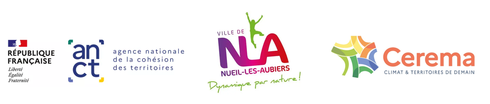
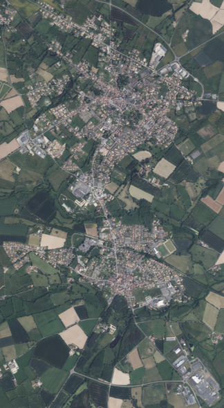

```{=html}
<!-- 
Au choix : image style page de garde ou simple titre
 -->
```

:::: {.study-header style="background-image: url('images/NLA_fond.jpg');"}
::: study-header-content
## Schéma des mobilités actives {.unnumbered .no-anchor}

### Neuil-Les-Aubiers {.unnumbered .no-anchor}

Fiches actions
:::
::::

<!-- la notation {.unnumbered} n'est utile que pour le format book afin de ne pas commencer le chapitrage -->

```{=html}
<!-- 
Si simple titre, enlever les commentaires
 -->
```

<!-- # Titre de l'étude {.unnumbered} -->

<!-- ## Sous titre de l'étude {.unnumbered} -->

> **Le Cerema**[^1], référent public en aménagement, accompagne l’État, les collectivités et les entreprises pour adapter les territoires au changement climatique.\
> Il joue un rôle clé dans l’élaboration et la mise en œuvre de politiques publiques nationales et de projets territoriaux adaptés au climat de demain dans 6 domaines d’activité : aménagement et stratégies territoriales, bâtiment, mobilités, infrastructures de transport, environnement et risques, mer et littoral.\
> Avec des équipes multidisciplinaires et 27 implantations sur les territoires de l’Hexagone et des Outre-mer, le Cerema dispose d’une approche globale pour conseiller, innover et fédérer.

[^1]: **Le Cerema est un établissement public relevant des ministères chargés de l’Aménagement du territoire et de la Transition écologique**



## Résumé de l'étude {.unnumbered}

La commune de Nueil-Les-Aubiers dispose d’un fort potentiel pour développer les modes actifs (marche et vélo), grâce à de nombreux déplacements internes (travail, achats, loisirs, etc.). Pourtant, ces modes restent peu utilisés, la voiture étant largement dominante, notamment pour les trajets domicile-travail. Cependant, les distances sont adaptées à la pratique des modes actifs : il est possible de traverser la commune à vélo en 15 minutes et de se déplacer à pied entre les centralités dans le même temps. L’étude vise à coordonner les différentes démarches liées à la mobilité, combler les manques, assurer la cohérence des aménagements et aboutir à un plan opérationnel favorisant les déplacements quotidiens à pied et à vélo.

## Objet de l'étude {.unnumbered}

-   Disposer d’une vision globale et transversale de l’ensemble des études relatives à la mobilité sur le territoire communal

-   Mettre en cohérence et créer du lien entre les différentes démarches engagées

-   Identifier les besoins complémentaires afin d’assurer la cohérence des aménagements

-   Élaborer un plan opérationnel des mobilités actives.

**L’objectif principal est de favoriser le développement de la marche et du vélo pour les déplacements du quotidien.**

### Remerciements

A Monsieur le Maire de la Commune de Nueil-Les-Aubiers et à tous les représentants de l’équipe municipale ainsi que des services techniques ayant participé aux 5 ateliers organisés en 2025 pour la construction de ce schéma directeur.



## Suivi {.unnumbered}

### Commanditaire {.unnumbered}

{fig-align="center"}

<!-- Auteur se retrouve en haut de la page de manière plus claire -->

<!-- ### Auteur : xxxxxx -->

### Responsable du rapport {.unnumbered}

| **Carine Flahaut –** Département Mobilité – Groupe Politiques de Mobilité Durable |
|------------------------------------------------------------------------|
| Direction Territoriale Sud-Ouest - 103, Rue Pierre Ramond 33160 Saint Médard en Jalles |

: {.table_cerema .hover}

### Historique des versions du document {.unnumbered}

| Version | Date       | Commentaire    |
|---------|------------|----------------|
| V1      | 24/03/2026 | Version finale |

: {.table_cerema .hover}

### Références {.unnumbered}

N° d’affaire / NOVA : 25-SO-0122

Partenaires : ANCT

<!-- NB : Signature électronique ou initiales uniquement, ne pas mettre de signature manuscrite -->

| Nom | Service | Rôle | Date et visa |
|------------------|------------------|------------------|------------------|
| Carine Flahaut | DM/PMD | **Auteur principal** | 24/03/2026 |
| Marion Valentin | DM/PMD | Contributeur et Relecteur | 31/03/2026 |
| May-Jeanne Thai-Van | DM/PMD | **Valideur : chef de projet** | 02/02/2026 |
|  | DM/PMD | **Valideur : responsable de production** |  |

: {.table_cerema .hover}

### Mots clefs {.unnumbered}

|                         |                  |                       |
|-------------------------|------------------|-----------------------|
| Déplacements quotidiens | Mobilités actifs | Aménagement cohérents |
| Sécurité                | Confort          | Accessibilité         |

: mots clefs {.table_cerema .hover}

### Statut de communication de l’étude {.unnumbered}

Tous les livrables produits sur SCSP (Subvention pour Charge de Service Public) doivent être publiés en accès libre.

Seules les exceptions figurant au CRPA peuvent limiter cette ouverture. Ces exceptions concernent uniquement les études réalisées pour tiers dont le contrat mentionne des restrictions de difusion limitées dans le temps, ou préparant une décision adminitrative.

Les livrables confidentiels ne sont pas capitalisés dans CeremaDoc, mais doivent être archivés selon la procédure d'archivage du Cerema.

Sur la base de ces informations, le statut de communication de l'étude est le suivant :

<!-- Respecter la syntaxe <i class="bi bi-square"></i> et <i class="bi bi-check-square"></i> pour les cases à cocher-->

<i class="bi bi-check-square"></i> Accès libre : document accessible au public sur internet

<i class="bi bi-square"></i> Accès restreint : document accessible uniquement aux agents du Cerema

<i class="bi bi-square"></i> Accès confidentiel : document non accessible

<!-- à ajouter si une version CeremaDoc est faite -->

<br> Cette étude est capitalisée sur la plateforme documentaire [CeremaDoc](https://doc.cerema.fr/Default/accueil-portal.aspx), via le dépôt de document : [Favoriser les modes actifs au sein d'une commune](https://www.cerema.fr/fr/projets/etude-mobilites-favoriser-modes-actifs-au-sein-commune)

## Introduction {.unnumbered}

::: img-float
{loading="lazy" style="float: left; margin-right: 15px;" width="164"}
:::

<br> Le diagnostic de cette étude met en évidence que Nueil-Les-Aubiers dispose d’un fort potentiel pour le développement des modes actifs. Les déplacements internes à la commune sont nombreux (achats, démarches administratives, rendez-vous médicaux, loisirs, études et travail).

Cependant, ces modes restent encore peu utilisés : 86 % des trajets domicile-travail s’effectuent en voiture, alors même que 46 % des actifs travaillent au sein de la commune.

Pourtant, les distances sont favorables aux mobilités douces : il est possible de parcourir l’ensemble de l’agglomération à vélo en 15 minutes, et les habitants peuvent également se déplacer facilement à pied entre les différentes centralités dans ce même laps de temps.
