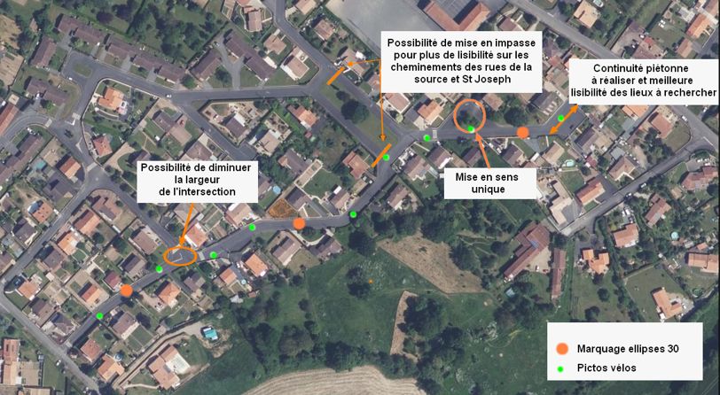
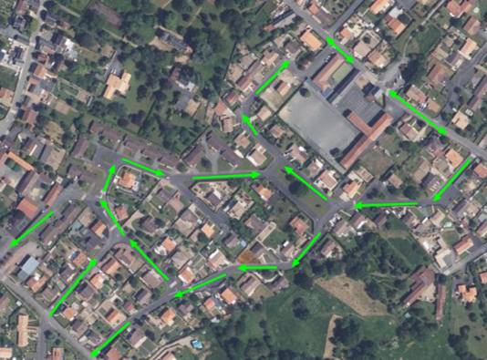
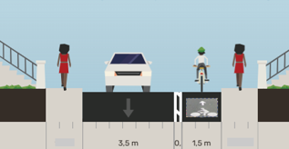
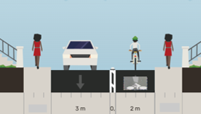

```{r}
writeLines(getwd(), "wd_debug.txt")
```

## Propositions d’aménagements pour favoriser le développement des modes actifs

```{r}
## =========================================================================
## Carte interactive - Aménagements vélo / piéton
## Packages : sf, leaflet, dplyr
## =========================================================================

# install.packages(c("sf", "leaflet", "dplyr"))  # si besoin
library(sf)
library(leaflet)
library(leaflet.extras2)
library(dplyr)
library(lwgeom)

## -------------------------------------------------------------------------
## 1. Chemins d'accès aux données
## -------------------------------------------------------------------------

dir_velo   <- "data/sig_velo"
dir_pieton <- "data/sig_pieton"

## Distance de decalage (en metres) entre les couches velo et pieton
## quand elles se superposent. A ajuster selon l'echelle habituelle de
## consultation de la carte.
offset_m <- 3
## -------------------------------------------------------------------------
## 2. Import des shapefiles
## -------------------------------------------------------------------------

chemin_velo               <- st_read(file.path(dir_velo,   "chemin_velo.shp"),               quiet = TRUE)
carrefour_dangereux_velo   <- st_read(file.path(dir_velo,   "carrefour_dangereux_velo.shp"),  quiet = TRUE)

chemin_pieton              <- st_read(file.path(dir_pieton, "chemin_pieton.shp"),             quiet = TRUE)
carrefour_dangereux_pieton <- st_read(file.path(dir_pieton, "carrefour_dangereux_pieton.shp"),quiet = TRUE)


numerotation_p <- st_read(file.path("data", "numerotation_p.shp"), quiet = TRUE)


## -------------------------------------------------------------------------
## 2. Classification des couches linéaires
## -------------------------------------------------------------------------

# --- Piétons : 4 catégories ---
chemin_pieton <- chemin_pieton %>%
  mutate(categorie = case_when(
    dangereux  == "t"                      ~ "Chemin dangereux",
    peu_circul == "t" & tiret == "t"        ~ "Voie peu circulée",
    peu_circul == "t" & is.na(tiret)        ~ "Chemin correct",
    mi_correct == "t"        ~ "Chemin améliorable"
  ))

chemin_pieton <- chemin_pieton %>% filter(!is.na(categorie))

# --- Vélos : 3 catégories ---
chemin_velo <- chemin_velo %>%
  mutate(categorie = case_when(
    a_amenage  == "t" ~ "Cheminement à aménager",
    correct    == "t" ~ "Aménagement correct",
    non_carros == "t" ~ "Chemin non carrossable"
  ))

chemin_velo <-chemin_velo %>% filter(!is.na(categorie))

## -------------------------------------------------------------------------
## 4. Decalage geometrique pour eviter les superpositions
##    (fait AVANT la reprojection en WGS84 : la distance doit etre
##    exprimee dans l'unite du CRS d'origine, generalement des metres)
## -------------------------------------------------------------------------
offset_m <- 3

normalize_direction <- function(line) {
  coords <- sf::st_coordinates(line)[, 1:2, drop = FALSE]   # <- ajout drop = FALSE
  if (nrow(coords) < 2) return(line)                         # <- garde-fou ajouté
  first <- coords[1, ]
  last  <- coords[nrow(coords), ]
  if (first[1] > last[1] || (first[1] == last[1] && first[2] > last[2])) {
    coords <- coords[nrow(coords):1, ]
  }
  sf::st_linestring(coords)
}

offset_linestring <- function(line, dist) {
  coords <- sf::st_coordinates(line)[, 1:2, drop = FALSE]   # <- ajout drop = FALSE
  n <- nrow(coords)
  if (n < 2) return(line)
  new_coords <- matrix(NA_real_, nrow = n, ncol = 2)
  for (i in 1:n) {
    if (i == 1)      { dx <- coords[2,1]-coords[1,1];   dy <- coords[2,2]-coords[1,2] }
    else if (i == n) { dx <- coords[n,1]-coords[n-1,1]; dy <- coords[n,2]-coords[n-1,2] }
    else             { dx <- coords[i+1,1]-coords[i-1,1]; dy <- coords[i+1,2]-coords[i-1,2] }
    len <- sqrt(dx^2 + dy^2)
    nx  <- if (len == 0) 0 else -dy/len
    ny  <- if (len == 0) 0 else  dx/len
    new_coords[i, ] <- c(coords[i,1] + nx*dist, coords[i,2] + ny*dist)
  }
  sf::st_linestring(new_coords)
}

offset_layer <- function(sf_obj, dist) {
  sf_obj <- sf::st_cast(sf_obj, "LINESTRING")
  geoms  <- sf::st_geometry(sf_obj)
  geoms  <- lapply(geoms, normalize_direction)          # <- ajout
  geoms  <- lapply(geoms, offset_linestring, dist = dist)
  sf::st_geometry(sf_obj) <- sf::st_sfc(geoms, crs = sf::st_crs(sf_obj))
  sf_obj
}

chemin_velo   <- offset_layer(chemin_velo, offset_m)
chemin_pieton <- offset_layer(chemin_pieton, -offset_m)

## -------------------------------------------------------------------------
## 5. Reprojection en WGS84 (obligatoire pour leaflet)
## -------------------------------------------------------------------------
 
chemin_velo               <- st_transform(chemin_velo,               crs = 4326)
carrefour_dangereux_velo   <- st_transform(carrefour_dangereux_velo,   crs = 4326)
chemin_pieton              <- st_transform(chemin_pieton,              crs = 4326)
carrefour_dangereux_pieton <- st_transform(carrefour_dangereux_pieton, crs = 4326)
numerotation_p             <- st_transform(numerotation_p,             crs = 4326)
 
## -------------------------------------------------------------------------
## 6. Palettes de couleurs (familles distinctes velo / pieton)
## -------------------------------------------------------------------------
 
# Pietons
pal_pieton <- colorFactor(
  palette = c("#e31a1c", "#1f78b4", "#33a02c", "#FFCE00"),
  domain = chemin_pieton$categorie,
  levels = c(
    "Chemin dangereux",
    "Voie peu circulée",
    "Chemin correct",
    "Chemin améliorable"
  )
)
 
# Velos 
pal_velo <- colorFactor(
  palette = c("#ff7f00", "#095228", "#7f0000"),
  domain = chemin_velo$categorie,
  levels = c(
    "Cheminement à aménager",
    "Aménagement correct",
    "Chemin non carrossable"
  )
)
 
## -------------------------------------------------------------------------
## 7. Lien vers l'ancre du secteur (dans le meme .qmd)
## -------------------------------------------------------------------------
 
 numerotation_p <- numerotation_p %>%
  mutate(url_fiche = paste0("#sec-numero-",sect_num))

## -------------------------------------------------------------------------
## 8. Construction de la carte
## -------------------------------------------------------------------------
 
carte <- leaflet() %>%
 
  # Fond de carte : Plan IGN v2 (flux WMS Geoplateforme)
  addWMSTiles(
    baseUrl = "https://data.geopf.fr/wms-r/wms",
    layers  = "GEOGRAPHICALGRIDSYSTEMS.PLANIGNV2",
    options = WMSTileOptions(
      version     = "1.3.0",
      format      = "image/jpeg",
      transparent = FALSE
    ),
    attribution = "IGN-F/Geoportail",
    group = "Fond IGN"
  ) %>%
 
  # --- Chemins pietons (trait plein) ---
  addPolylines(
    data    = chemin_pieton,
    color   = ~pal_pieton(categorie),
    weight  = 4,
    opacity = 0.9,
    label   = ~categorie,
    group   = "Chemins pietons"
  ) %>%
 
  # --- Chemins velo (trait pointille) ---
  addPolylines(
    data      = chemin_velo,
    color     = ~pal_velo(categorie),
    weight    = 4,
    opacity   = 0.9,
    dashArray = "8,6",
    label     = ~categorie,
    group     = "Chemins velo"
  ) %>%
 
  # --- Carrefours dangereux : etoile rouge discrete (piéton) ---
  addDivicon(
    data       = carrefour_dangereux_pieton,
    html = "<div style='display:flex; align-items:center; justify-content:center;
                     width:24px; height:24px; background:rgba(255,255,255,0.65);
                     border-radius:50%;'>
          <span style='color:#d90000; font-size:16px;'>&#9733;</span>
        </div>",
    label      = "Carrefour dangereux (pieton)",
    className  = "etoile-discrete",
    divOptions = list(iconSize = c(24, 24), iconAnchor = c(12, 12)),
    group      = "Carrefours dangereux"
  ) %>%
 
  # --- Carrefours dangereux : etoile rouge discrete (velo) ---
  addDivicon(
    data       = carrefour_dangereux_velo,
    html       = "<div style='display:flex; align-items:center; justify-content:center;
                     width:24px; height:24px; background:rgba(255,255,255,0.65);
                     border-radius:50%;'>
          <span style='color:#d90000; font-size:16px;'>&#9733;</span>
        </div>",
    label      = "Carrefour dangereux (velo)",
    className  = "etoile-discrete",
    divOptions = list(iconSize = c(24, 24), iconAnchor = c(12, 12)),
    group      = "Carrefours dangereux"
  ) %>%
 
  # --- Numerotation : pastilles blanches cliquables (ancre vers le secteur) ---
  addDivicon(
    data       = numerotation_p,
    html       = ~sprintf(
      "<a href='%s' style='text-decoration:none;'>
         <div style='background:#ffffff; border:2px solid #000000; border-radius:50%%;
                     width:26px; height:26px; display:flex; align-items:center;
                     justify-content:center; font-weight:bold; font-size:12px; color:#000000;'>
           %s
         </div>
       </a>",
      url_fiche, sect_num
    ),
    className  = "numero-badge",
    divOptions = list(iconSize = c(26, 26), iconAnchor = c(13, 13)),
    group      = "Numerotation"
  ) %>%
 
  # --- Legendes ---
  addLegend(
    position = "bottomright",
    pal      = pal_pieton,
    values   = chemin_pieton$categorie,
    title    = "Chemins pietons",
    group    = "Chemins pietons"
  ) %>%
  addLegend(
    position = "bottomright",
    pal      = pal_velo,
    values   = chemin_velo$categorie,
    title    = "Chemins velo",
    group    = "Chemins velo"
  ) %>%
 
  # --- Controle des couches ---
  addLayersControl(
    baseGroups    = "Fond IGN",
    overlayGroups = c("Chemins pietons", "Chemins velo", "Carrefours dangereux", "Numerotation"),
    options       = layersControlOptions(collapsed = FALSE)
  )
 
carte
```

## Centralité Nord : CN

### Secteur 1 {#sec-numero-N1}

Analyse des itinéaires : **Rue des sources**

**Caractéristiques :**

-   Rue résidentielle peu circulée en journée sauf aux heures d’entrée et sortie de collège

-   Double-sens

-   Circulation bus scolaire dans un sens

::: {style="text-align:center;"}
{fig-align="center" loading="lazy" width="350"}
:::

Quelques adaptations peuvent être mises en place afin de rendre la traversée de la rue plus lisible et marquer la place des cyclistes sur la chaussée.

Le marquage d’ellipses 30 permettront de rappeler aux usagers qu’ils traversent une zone 30.

::: {style="text-align:center;"}
{fig-align="center" loading="lazy" width="350"}
:::

Afin de donner plus de place aux cyclistes, une réflexion pourrait être menée pour mettre en sens unique cette rue, ainsi que les rues St Joseph et des Jardiniers. Afin de diminuer la largeur de la chaussée, le double-sens cyclable pourra être matérialisé par un marquage séparatif ou par la création d’un piste cyclable dans les secteurs les plus larges.

:::::::: columns
:::: {.column width="48%"}
::: {style="text-align:center;"}
{fig-align="center" loading="lazy" width="350"}
:::

Le double-sens cyclable pourra être matérialisé par un marquage séparatif adapté et des pictos vélos dans les sections les plus étroites
::::

::: {.column width="4%"}
:::

:::: {.column width="48%"}
::: {style="text-align:center;"}
{fig-align="center" loading="lazy" width="350"}
:::

Le double-sens cyclable pourra être matérialisé par une piste cyclable unidirectionnelle de 2 m de large séparée par une bordure chanfreinée dans les sections les plus larges
::::
::::::::

### Secteur 2 {#sec-numero-N2}

### Secteur 3 {#sec-numero-N3}

### Secteur 4 {#sec-numero-N4}

### Secteur 5 {#sec-numero-N5}

### Secteur 6 {#sec-numero-N6}

### Secteur 7 {#sec-numero-N7}

### Secteur 8 {#sec-numero-N8}

### Secteur 9 {#sec-numero-N9}

### Secteur 10 {#sec-numero-N10}

### Secteur 11 {#sec-numero-N11}

### Secteur 12 {#sec-numero-N12}

### Secteur 13 {#sec-numero-N13}

### Secteur 14 {#sec-numero-N14}

### Secteur 15 {#sec-numero-N15}

### Secteur 16 {#sec-numero-N16}

### Secteur 17 {#sec-numero-N17}

### Secteur 18 {#sec-numero-N18}

## Centre-Ville : CV

### Secteur 1 {#sec-numero-V1}

### Secteur 2 {#sec-numero-V2}

### Secteur 3 {#sec-numero-V3}

### Secteur 4 {#sec-numero-V4}

## Centralité Sud : CS

### Secteur 1 {#sec-numero-S1}

### Secteur 2 {#sec-numero-S2}

### Secteur 3 {#sec-numero-S3}

### Secteur 4 {#sec-numero-S4}

### Secteur 5 {#sec-numero-S5}

### Secteur 6 {#sec-numero-S6}

### Secteur 7 {#sec-numero-S7}

### Secteur 8 {#sec-numero-S8}

### Secteur 9 {#sec-numero-S9}

### Secteur 10 {#sec-numero-S10}

### Secteur 11 {#sec-numero-S11}

### Secteur 12 {#sec-numero-SN12}

### Secteur 13 {#sec-numero-S13}

### Secteur 14 {#sec-numero-S14}

### Secteur 15 {#sec-numero-S15}

### Secteur 15b {#sec-numero-S15b}

### Secteur 16 {#sec-numero-S16}

### Secteur 17 {#sec-numero-S17}

### Secteur 18 {#sec-numero-S18}

### Secteur 19 {#sec-numero-S19}

### Secteur 20 {#sec-numero-S20}

### Secteur 21 {#sec-numero-S21}

## Jalonnement

## Programmation et premiers éléments de chiffrage

## Aides financières
